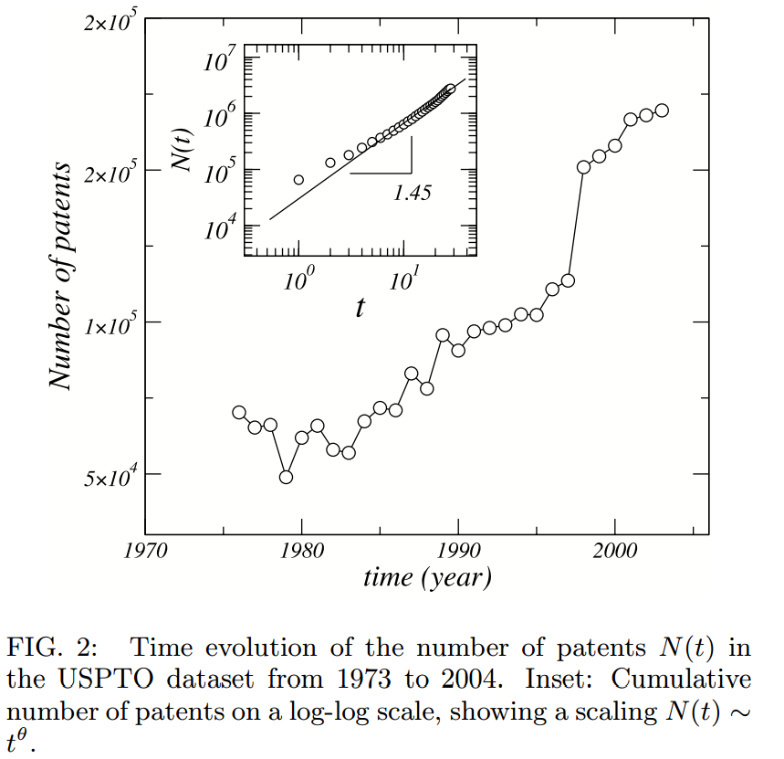

```{r setup}
library(readr)
library(lubridate)
library(dplyr)
library(ggplot2)
library(ggthemes)
```

The data being used for these plots in the cleaned concatonated patent data produced by the 'cleaned' script. We have extracted the year into a seperate feature as it is this which the data is summarised over. It contains a list of the patent numbers and date in which those patents were granted. 

```{r read data, echo=TRUE}
# Read data
data <- read_csv("../DataFiles/Cleaned/patent_cat.csv")
data$Year <- year(data$Date2)
str(data)
```
## Plot 1: Patents granted by year
The first plot counts the number of patents granted by year, there is an inset which looks at this as a cumulative sum on a log-log scale.



In order to process the data into a tidy format processable by ggplot, we summarise it counting the number of entries (patents) for each year. There are a few outliers (`r nrow(data %>% group_by(Year) %>% summarise(count = n()) %>% filter(!(Year %in% 1976:2015)))`) so this is then filtered to only allow only patents within that range. 

```{r plot1 data summary}
# Summarise results
year_counts <- data %>% group_by(Year) %>% summarise(count = n()) %>% filter(Year %in% 1976:2015)
```

```{r plot1}
gg <- ggplot(data = year_counts, aes(x = Year, y = count)) +
    geom_line() +
    geom_point(shape = 19) +
    scale_x_continuous(limits = c(1970,2020), minor_breaks = seq(1975, 2015, 10) ) +
    scale_y_continuous(limits = c(5e4, 3.5e5), breaks = seq(5e4, 35e4, 5e4)) +
    theme_bw()
gg
```
### Notes on plot1

From our reproduction of the first figure we can make some observations:

 * Although exact numbers aren't given by cross referencing the two graphs certainly __follow the same shape__. 
    * In terms of exact numbers the region leading __up to 1990 seems identical__ but __after this point there may be larger numbers in our data__, e.g. in our data 1997 reaches 1.25e5 but there's is much closer to 1.18 ish. A fairly constant gap of around this ammount seems to persist until the end of the data. 
    * I have parsed foreign patents but on an earlier encarnation when foreign patents were missed there was a large discrepency in number of patents on this graph. So there could be a systematic parsing error or difference in what is being parsed. Either way I believe this my parsing to be more accurate but an analysis into the differences between this graph and other uspto data sources for patent counts has been conducted elsewhere to check for systematic problems.
 * The data has a __jump at the year 1997-1998__. 
 * Valverde's data ends at 2004, __after 2005__ the number of patents becomes much __more erratic__ but also __climbs very steeply__. 
 * Worth noting is that there are 3 different formats in which the data was stored, a propriotary format from 1976:2001, an sgml format from 2001:2004 and an xml format since then (although there have been minor itterations to this format since). 
    * In a previous version of the analysis the method for parsing sgml and propriotary had systematic differences so there was a step at the year 2001. The current parsing method uses the same method for each data type to ensure consistency. Having said this the erratic behaviour starts at the same time xml is begun to be used.  

## Plot1 inset

The inset of plot 1, shows the "Cumulative number of patents on a log-log scale, showing a scaling: $N(t) \sim t^\theta$"
```{r plot1_inset data summary}
year_counts$cum_count <- cumsum(year_counts$count)
year_counts$rel_year <- year_counts$Year - 1975
```

```{r plot1_inset}
gg <- ggplot(data = year_counts, aes(x = rel_year, y = cum_count)) + 
    geom_point() +
    scale_x_log10() +
    scale_y_log10() + 
    theme_bw() +
    labs(x = "t", y = "N(t)")
    #stat_smooth(method = "lm") +
gg
```

```{r plot1_inset linear regression, fig.height=4, fig.width=7}
lm1 <- lm(log10(cum_count) ~ log10(rel_year), data = year_counts)

gg + 
    geom_abline(intercept = lm1$coefficients[1], slope = lm1$coefficients[2]) + 
    ggtitle("linear fit of all points") +
    annotate(label = round(lm1$coefficients[2],2), x = 10, y = 4e5, geom = "text", size = 5)

t <- year_counts %>% filter(Year %in% 1985:2004)
lm2 <- lm(log10(cum_count) ~ log10(rel_year), data = t)
gg + 
    geom_abline(intercept = lm2$coefficients[1], slope = lm2$coefficients[2]) + 
    ggtitle("linear fit over 1985:2014") +
geom_point(data = t, col = "red") +
    annotate(label = round(lm2$coefficients[2],2), x = 10, y = 4e5, geom = "text", size = 5)

```

### Notes on plot1 inset
 
 * To address the claim that this is an approxmately linear relationship, it does appear to not be linear.
    * Having said that the claim is that it is close to linear which is fairly accurate, the R-squared for the linear fit of all of the data is `r summary(lm1)$r.squared`
 * In fact it also seems like the axes were stretched to make the linear fit look nicer in the plot. Finally to get the fit found in the paper you have to ignore the first set of points (we found 1985:2004 although its conceievable a larger range was used with the differences in patent counts in our analysis) and finally this relationship doesn't hold into the new data since 2004.
 
## Plot2: In degree distribution

```{r plot2 data summary}
degree_distribution <- data %>% group_by(Year, Order) %>% summarise(count = n()) %>% filter(Year %in% c(1984, 1992, 2002, 2012))
```

```{r}
gg <- ggplot(data = degree_distribution, aes(x = Order, y = count, col = as.factor(Year))) +
    geom_point(size = 0.5) + 
    scale_x_log10() +
    scale_y_log10() +
    theme_bw() 

gg
```


### Notes on plot2
 
 * We see the effect where average number of citations is increasing continue into 2012
 * The big difference between our data and valverde's is that up to a peak of 7-9 the average citations is increasing whereas valerde' only decreases from a peak of 1 citation. 
    * This could indicate that valverde doesn't include __foreign citations__ whereas we do. 
    
```{r}
degree_distribution2012 <- degree_distribution %>% filter(Year == 2012)
plfit = displ$new(degree_distribution2012$count)
est = estimate_xmin(plfit)
plfit$setXmin(est)

fit = plot(plfit)
fit2 =  lines(plfit, col = 2)

gg + geom_curve(aes(x = fit2$x, y = fit2$y))
```

```{r}
pwrdist <- function(u,...) {
    # u is vector of event counts, e.g. how many
    # crimes was a given perpetrator charged for by the police
    fx <- table(u)
    i <- as.numeric(names(fx))
    y <- rep(0,max(i))
    y[i] <- fx
    m0 <- glm(y~log(1:max(i)),family=quasipoisson())
    print(summary(m0))
    sub <- paste("s=",round(m0$coef[2],2),"lambda=",sum(u),"/",length(u))
    plot(i,fx,log="xy",xlab="x",sub=sub,ylab="counts",...)
    grid()
    lines(1:max(i),(fitted(m0)),type="b")
    return(m0)
}
pwrdist(degree_distribution2012$count)
```

