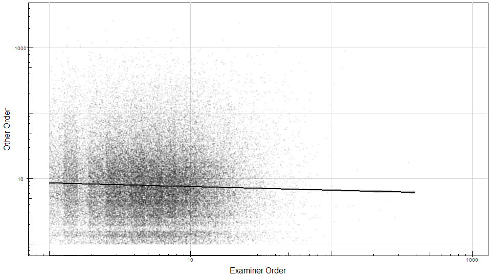

```{r setup, echo=FALSE, message=FALSE}
knitr::opts_chunk$set(results = 'hold')
knitr::opts_chunk$set(warning = FALSE)
knitr::opts_chunk$set(echo = FALSE)

library(fBasics)
library(dplyr)
library(ggplot2)
library(rmongodb)
library(poweRlaw)
library(gridExtra)
source("plot_theme.R")
```

In this notebook we compare the distribution of citations by which group of people cited them. Cited by examiner is exactly that whereas "Cited by other"" indicates those cited in a protest, by an attorney or agent not acting in a representative capacity but on behalf of a single inventor, and by the applicant.

### Data

In order to analyse these two groups we first used map reduce functions in mongodb to group the citations by "CitedBy" and "Patent" and count the totals. Another mapreduce added this information to the patent collection before a final mapreduce aggregated frequencies of these orders each year. 

Below we can see how the data has been formatted by thesee map reduces, each Year/Order combination has a row and the frequencies of patents which that order of citations for each category is recorded (Examiner, Other, Total, Total2). Total indicates the total when previously calculating order (while originally processing the data) and Total2 is the equivalent through map reduce. 
```{r loadData, echo=FALSE}
if (file.exists("Dat/orderFrequencies.rds")) {
    orderFrequencies <- readRDS("Dat/orderFrequencies.rds")
} else {
    mongo <- mongo.create()
    mongo.is.connected(mongo)
    db <- "sotonproject"
    orderFrequencies <- mongo.find.all(mongo, "sotonproject.orderFrequencies")
    mongo.destroy(mongo)
    orderFrequencies <- lapply(orderFrequencies, unlist)
    orderFrequencies <- as.data.frame(orderFrequencies)
    orderFrequencies <- t(orderFrequencies)
    rownames(orderFrequencies) <- NULL
    colnames(orderFrequencies) <- c("Year", "Order", "Examiner", "Other", "Total", "Total2")
    orderFrequencies <- as.data.frame(apply(orderFrequencies, 2, as.numeric))
    saveRDS(orderFrequencies, "Dat/orderFrequencies.rds")
}

str(orderFrequencies)
```

There are some differences (processingDifferences) between the order calculated through the citations using map reduce (Total2) and the order calculated while processing the data (Total).

The average error is 0, which means all the citations each year are being processed in both methods. We can see that the errors largely alternate between positive and negative, namely that the differences may be one additional citation on one patent meaning one less on the adjacent patent. The errors are only present in the xml not the sgml years 2005 onwards and while increase over time this is likely in line with increasing number of patents. In 2015 there about 10% are effected. 

```{r processingDifferences, echo=F}
orderFrequencies$processingDifferences <- orderFrequencies$Total - orderFrequencies$Total2
summary(orderFrequencies %>% select(processingDifferences))

dat <- orderFrequencies %>% group_by(Year) %>% summarise(diffTotal = sum(processingDifferences), absDiffTotal = sum(abs(processingDifferences)))
gg1 <- ggplot(dat, aes(x = Year, y = absDiffTotal)) +
    geom_point() +
    theme_pub() +
    labs(y = "Patents with differences in Order") +
    theme(panel.grid.minor.x = element_blank(),
           panel.grid.minor.y = element_blank(),
          panel.grid.major.x = element_blank()) +
    scale_x_continuous(breaks = seq(2001, 2015, 1))
    

dat2 <- orderFrequencies[orderFrequencies$processingDifferences != 0,] %>% 
    filter(Year %in% c(2006, 2010, 2014))
gg2 <- ggplot(dat2, aes(x = Order, y = (processingDifferences), col = as.character(Year))) +
    geom_point(aes(shape = as.character(Year), colour = as.character(Year)), size = 1, alpha = 0.4) +
    geom_smooth(size=1, method="loess", formula = y ~ x,
                 span=0.1, se=FALSE, aes(linetype = as.character(Year))) +
    scale_x_continuous(limits = c(0,75)) +
    theme_pub() +
    scale_linetype_manual(values = Scheme[years2, "linetype"]) +
    scale_colour_manual(values = Scheme[years2, "colour"]) +
    theme(legend.position = c(0.8,0.2)) +
    labs(y = "Relative patent count")

# Graph showing the relative number of patents at each order through two different methosd (parsing - mapReduce), the tail is cut off but continues to converge to 0. 


grid.arrange(gg1, gg2)
```

```{r save plots}
png("Figures/parsingErrorsPerYear.png"); gg1; dev.off()
png("Figures/parsingErrorsPerOrder.png"); gg2; dev.off()
saveRDS(gg1, "Figures/parsingErrorsPerYear.rds")
saveRDS(gg2, "Figures/parsingErrorsPerOrder.rds")
```

This shows that the mapReduce methodology has more citations with low order whereas 
From this data we cannot judge the size of the differences only that the mapReduce is either loosing some citation information OR the parsing method is adding some.

```{r powerLaw gradient Function, include=FALSE}
lm_func <- function(x = NA, y = "count", var = "Total2", year = 2002, data = orderFrequencies, xmin = 20, xmax = 200) { 
    dat <- data %>% filter(Year == year, Order > xmin, Order < xmax) 
    dat$Order[dat$Order == 0] <- NA
    dat[,var][dat[,var] == 0] <- NA
    model <- switch(y, 
                    "count" = lm(data = dat, formula = log10(get(var)) ~ log10(Order)), 
                    "freq" = lm(data = dat, formula = log10(freq) ~ log10(Order))) 
    list(func = model$coefficients[2] * log10(x) + model$coefficients[1], coef = model$coefficients)
} 
lm_func()
```

## Order Distribution

```{r reproducing plot2, echo=FALSE}
dat <- orderFrequencies %>% filter(Year == 2002)
legend.total <- paste("Total", round(lm_func()$coef[2],2))
legend.other <- paste("Other", round(lm_func(var = "Other")$coef[2],2))
legend.examiner <- paste("Examiner", round(lm_func(var = "Examiner")$coef[2],2))

gg3 <- ggplot(data = dat, aes(x = Order, y = Total2)) +
    geom_point(size = 0.5, colour = Scheme["Total","colour"]) +
    geom_point(size = 0.5, aes(y = Other), colour = Scheme["Other","colour"]) +
    geom_point(size = 0.5, aes(y = Examiner), colour = Scheme["Examiner","colour"]) +
    scale_x_log10(
        breaks = scales::trans_breaks("log10", function(x) 10^x),
        labels = scales::trans_format("log10", scales::math_format(10^.x))
    ) +
    scale_y_log10(
        breaks = scales::trans_breaks("log10", function(x) 10^x),
        labels = scales::trans_format("log10", scales::math_format(10^.x)),
        limits = c(1, 5e4)
    ) +
    stat_function(fun = function(x) lm_func(x)$func, geom = 'line', size = 1.3,
                  aes(colour = citedBy["Total"],
                      linetype = citedBy["Total"])) +
    stat_function(fun = function(x) lm_func(x, var = "Other")$func, size = 1.3, geom = 'line',
                  aes(colour = citedBy["Other"], 
                      linetype = citedBy["Other"])) +
    stat_function(fun = function(x) lm_func(x, var = "Examiner", xmax = 90)$func, geom = 'line', size = 1.3,
                  aes(colour = citedBy["Examiner"], linetype = citedBy["Examiner"])) +
    scale_colour_manual(values = c("Other" = Scheme["Other","colour"],
                                   "Total" = Scheme["Total", "colour"],
                                   "Examiner" = Scheme["Examiner", "colour"])) +
    scale_linetype_manual(values = c("Other" = Scheme["Other","linetype"],
                                   "Total" = Scheme["Total", "linetype"],
                                   "Examiner" = Scheme["Examiner", "linetype"])) +
    theme_pub() +
    theme(legend.title=element_blank(), legend.position = c(0.8,0.8), legend.key = element_blank()) +
    annotation_logticks() +
    labs(y = "Number of Patents")

gg3
```
 
 * Examiner has a smaller range of values (steeper gradient), goes to about 100 rather than 1000. 
 * Examiner has larger frequencies at low orders. 
 * Examiner seems to be a little better fit for a power law. 
```{r save plot}
png("Figures/orderDistributionCitedBy.png"); gg3; dev.off()
saveRDS(gg3, "Figures/orderDistributionCitedBy.rds")
```

## Change in Power-Law gradient over time

```{r plot power law gradients, echo=F}
load("Dat/powerLawFits.rdata")

vec <- NULL
for (i in seq_along(pl)) {
    new <- pl[[i]]$distributions$pl$getPars()
    vec <- c(vec, new)
}
vecExaminer <- NULL
for (i in seq_along(pl_Examiner)) {
    new <- ifelse(is.null(pl_Examiner[[i]]),
                  NA,
                  pl_Examiner[[i]]$distributions$pl$getPars())    
    vecExaminer <- c(vecExaminer, new)
}
vecOther <- NULL
for (i in seq_along(pl_Other)) {
    new <- ifelse(is.null(pl_Other[[i]]),
                  NA,
                  pl_Other[[i]]$distributions$pl$getPars())
    vecOther <- c(vecOther, new)
}

```

 * The gradients of examiner and other vary because it is clearly not a power law but we are trying to fit it to one (see graph below). 
 * When the other is fitted to the start of the curve it appears to loosely follow the total. 
 * This is not the case with the examiner plot, which show much stronger resemblence to power laws. 
 * While the examiner gradients vary it could be said to loosely follow the shape of the total. 
 * An interesting conclusion here is that the total is dominated by the other which doesn't follow a power law in the years we have the data for, so the total also is probably not followint a power law for these earlier years. 
```{r}
years <- 1976:2015
dat <- data.frame(Year = years, Total = -vec, Other = vecOther, Examiner = vecExaminer)
gg1 <- ggplot(dat, aes(x = Year, y = Total)) +
    geom_point(aes(colour = citedBy["Total"], shape = citedBy["Total"]),
               size = 2) +
    geom_point(aes(y = -Other, colour = citedBy["Other"], shape = citedBy["Other"]), 
               size = 2) +
    geom_point(aes(y = -Examiner, colour = citedBy["Examiner"], shape = citedBy["Examiner"]), 
               size = 2) +
    scale_color_manual(values = Scheme[citedBy, "gray"]) +
    scale_shape_manual(values = Scheme[citedBy, "shape"]) +
    theme_pub() +
    theme(legend.position = c(0.2, 0.8), legend.title = element_blank()) +
    labs(y = "Power-law Exponent")
gg1

```
```{r}
png("Figures/paramsOverTime_pl.png"); gg1; dev.off()
saveRDS(gg1, "Figures/paramsOverTime_pl.rds")
```

```{r}
years <- 1976:2015
vec <- NULL

type = "Total"
for (i in seq_along(pl)) {
    year <- years[i]
    pars <- pl[[i]]$distributions$ln$getPars()
    new <- c(type, year, pars)
    vec <- rbind(vec, new)
}
type = "Other"
for (i in seq_along(pl_Other)) {
        if (is.null(pl_Examiner[[i]]))  {
        pars <- c(NA,NA)
    } else {
    pars <- pl_Other[[i]]$distributions$ln$getPars()
    }
    year <- years[i]
    new <- c(type, year, pars)
    vec <- rbind(vec, new)
}
type = "Examiner"
for (i in seq_along(pl_Examiner)) { 
    if (is.null(pl_Examiner[[i]])) {
        pars <- c(NA,NA)
    } else {
    pars <- pl_Examiner[[i]]$distributions$ln$getPars()
    }
    year <- years[i]
    new <- c(type, year, pars)
    vec <- rbind(vec, new)
}

vec <- data.frame(vec, row.names = NULL)
colnames(vec) <- c("CitedBy", "Year", "Mean", "Sd")
vec[,c("Year", "Mean", "Sd")] <- sapply(vec[,c("Year", "Mean", "Sd")], function(x) as.numeric(as.character(x)))

```

```{r}
gg <- ggplot(vec, aes(x = Mean, y = Sd, col = Year)) + 
    geom_point(size = 2) + 
    facet_wrap(~CitedBy, ncol = 1) +
    theme_pub() +
    scale_color_gradient(low = "grey", high = "black") +
    theme(legend.position = "right") +
    guides(colour = guide_colorbar(barheight = 15)) +
    labs(y = "Standard Deviation") +
        theme(panel.grid.minor.x = element_blank(),
           panel.grid.minor.y = element_blank()) 

gg

gg2 <- 
    gg +
    scale_x_continuous(limits = c(-30,5)) +
    scale_y_continuous(limits = c(0,5)) +
    theme(panel.grid.minor.x = element_blank(),
          panel.grid.minor.y = element_blank()) 
```

```{r}
png("Figures/logNormalParams.png"); gg; dev.off()
png("Figures/logNormalParams_zoomed.png"); gg2; dev.off()
saveRDS(gg, file = "Figures/logNormalParams.rds")
saveRDS(gg2, file = "Figures/logNormalParams_zoomed.rds")
```


```{r pl other example}
par(mfrow = c(2,2))
plot(pl_Other[[2003 - 1975]]$distributions$pl, main = "2003 Power-law Other")
lines(pl_Other[[2003 - 1975]]$distributions$pl, col = "red")
plot(pl_Other[[2004 - 1975]]$distributions$pl, main = "2004 Power-law Other")
lines(pl_Other[[2004 - 1975]]$distributions$pl, col = "red")
plot(pl_Examiner[[2003 - 1975]]$distributions$pl, main = "2003 Power-Law Examiner")
lines(pl_Examiner[[2003 - 1975]]$distributions$pl, col = "red")
plot(pl_Examiner[[2004 - 1975]]$distributions$pl, main = "2004 Power-Law Examiner")
lines(pl_Examiner[[2004 - 1975]]$distributions$pl, col = "red")
par(mfrow = c(1,1))
```


## Power-law vs. log-normal

In this section we compare how well power law fits perform relative to log-normal fits of the data. 
We first consider a sample year and use the "poweRlaw" package to fit power-law, log-normal, exponential and poisson distributions to the "Examiner" and "Other" distributions seperately. In the below plots we use 2001 as an example year and fit a variety of discrite distibutions to the distribution of orders. 

#### Examiner
```{r Fitting Distributions: Examiner}
par(mfrow = c(2,2))
    par(cex = .5)
    par(lwd = 2)
    plot(pl_Other[[2001 - 1975]]$distributions$pl, main = "power-law") 
    lines(pl_Other[[2001 - 1975]]$distributions$pl, col="green") 
    plot(pl_Other[[2001 - 1975]]$distributions$ln, main = "log-normal")
    lines(pl_Other[[2001 - 1975]]$distributions$ln, col = "red") 
    plot(pl_Other[[2001 - 1975]]$distributions$exp, main = "exponential") 
    lines(pl_Other[[2001 - 1975]]$distributions$exp, col="blue") 
    plot(pl_Other[[2001 - 1975]]$distributions$pois, main = "poisson")
    lines(pl_Other[[2001 - 1975]]$distributions$pois, col="orange") 
    
print(paste("Upper Limit on probability given power law is true", pl_Other[[2001 - 1975]]$comparisons$powerlaw[2])) 
print(paste("Upper Limit on probability given log-normal is true",pl_Other[[2001 - 1975]]$comparisons$lognormal[2])) 
print(paste("Upper Limit on probability given both are true",pl_Other[[2001 - 1975]]$comparisons$lognormal[3])) #

par(mfrow = c(1,1))
```

* While none of the distributions catch the shape of the tail the log-normal seems to most closely relate to the distribution with poisson clearly being false. Exponential capturing the start of the distribution and power-law capturing the center of the distribution. 
 * This therefore could both be a power-law with exponential cut-off (e.g. extended power-law) or a log-normal. 

#### Other
```{r Fitting Distributions: Other}
par(mfrow = c(2,2))
    par(cex = .5)
    par(lwd = 2)
    plot(pl_Examiner[[2001 - 1975]]$distributions$pl, main = "power-law") 
    lines(pl_Examiner[[2001 - 1975]]$distributions$pl, col="green") 
    plot(pl_Examiner[[2001 - 1975]]$distributions$ln, main = "log-normal")
    lines(pl_Examiner[[2001 - 1975]]$distributions$ln, col = "red") 
    plot(pl_Examiner[[2001 - 1975]]$distributions$exp, main = "exponential") 
    lines(pl_Examiner[[2001 - 1975]]$distributions$exp, col="blue") 
    plot(pl_Examiner[[2001 - 1975]]$distributions$pois, main = "poisson")
    lines(pl_Examiner[[2001 - 1975]]$distributions$pois, col="orange") 
    
print(paste("Upper Limit on probability given power law is true", pl_Examiner[[2001 - 1975]]$comparisons$powerlaw[2])) 
print(paste("Upper Limit on probability given log-normal is true",pl_Examiner[[2001 - 1975]]$comparisons$lognormal[2])) 
print(paste("Upper Limit on probability given both are true",pl_Examiner[[2001 - 1975]]$comparisons$lognormal[3])) #

par(mfrow = c(1,1))
```
 * The log0normal here is able to capture the entire distribution including most of the variation in the tail. 
 * Exponential and poisson don't fit any part of the distribution to a reasonable degree (even the start like before)
 * Power-law looks more dubious as no part of the distribution looks truely straight on log-log scale. 
 * Conclusion: This clearly looks like a log-normal distribution. 
 
## Scatterplot between orderOther and orderExaminer

In this section we consider the relationship between Other and Examiner citations through a scatterplot and their possible correlation. 

```{r load scatterplot data}
if (file.exists("Dat/orderScatterplotData.rds")) {
    scatterplotData <- readRDS("Dat/orderScatterplotData.rds")
} else {
    mongo <- mongo.create()
    mongo.is.connected(mongo)
    db <- "sotonproject"
    scatterplotData <- mongo.find.all(mongo, "sotonproject.ExaminerOtherScatterplot")
    mongo.destroy(mongo)
    scatterplotData <- lapply(scatterplotData, unlist)
    scatterplotData <- as.data.frame(scatterplotData)
    scatterplotData <- t(scatterplotData)[,2:3]
    rownames(scatterplotData) <- NULL
    colnames(scatterplotData) <- c("Examiner", "Other")
    scatterplotData <- as.data.frame(apply(scatterplotData, 2, as.numeric))
    saveRDS(scatterplotData, "Dat/orderScatterplotData.rds")
}

```

```{r scatterplots}
set.seed(911)
scatterplotSample <- scatterplotData %>% sample_n(100000)
gg <- ggplot(data = scatterplotSample, aes(x = Examiner, y = Other)) +
    scale_x_log10(limits = c(1,NA)) + 
    scale_y_log10(limits = c(1,NA)) + 
    annotation_logticks() + 
    theme_pub() + 
    labs(x = "Examiner Order", y = "Other Order")


gg1 <- gg  + stat_density_2d(aes(fill = ..level..), geom = "polygon") +
    scale_fill_gradient(name = "Kernel Density", low = "light grey", high = "black", guide = "legend") +
    theme(legend.title = element_text(),
          legend.position = c(0.9, 0.8))


gg2 <- gg + 
    geom_jitter(alpha = 1/20, shape = 20, width = 0.5, height = 0.5) + 
    stat_smooth(method = "lm", colour = "goldenrod", size = 2)

gg1
gg2
```

```{r}
png("Figures/orderScatterplot.png", height = 540, width = 960); gg2; dev.off()
png("Figures/orderScatterplotContours.png", height = 540, width = 960); gg1; dev.off()
saveRDS(gg2, file = "Figures/orderScatterplot.rds")
saveRDS(gg1, file = "Figures/orderScatterplotContours.rds")

```




```{r pearson correlation coefficient}
datlog10 <- log10(scatterplotSample)
datlog10 <- datlog10[!is.infinite(datlog10$Examiner),]
datlog10 <- datlog10[!is.infinite(datlog10$Other),]

correlations <- NULL
correlations$kendall <- kendallTest(scatterplotSample[,1], scatterplotSample[,2])
correlations$pearson <- pearsonTest(scatterplotSample[,1], scatterplotSample[,2])
correlations$pearsonLog <- pearsonTest(datlog10[,1], datlog10[,2])
```

## Comparing average of order of Other for given Examiner and vice versa

 * Below we see the average of other for a given examiner, followed by vice versa, followed by a repitition using median instead of mean. 
 * We use 3 different bins (0 binning, bin size of 20 and bin size of 40)
 * We Expect to see something flat
    * While its hard to see a pattern it doesn't necessarily look flat when looking at the mean
    * I hypothesised because this is a heavy tailed distribution the mean is biased so we look at the median instead
    * The median shows distributions that do indeed look flat
    

```{r}
breaks = exp(seq(0, log(max(scatterplotData$Examiner)), length.out = 11))
midpoint <- apply(data.frame(breaks, lead(breaks, 1)), 1, mean) %>% na.omit()
dat <- scatterplotData %>% 
    arrange(Examiner) %>% 
    mutate(bins = cut(Examiner, 
                      breaks, 
                      include.lowest = T, right = F)) %>%
    na.omit() %>% 
    group_by(bins) %>%
    summarise(median = boxplot.stats(Other)$stats[2], 
              lower = boxplot.stats(Other)$stats[1],
              upper = boxplot.stats(Other)$stats[3],
              mean = mean(Other),
              sd = sd(Other)) %>% 
    mutate(midpoint = midpoint[as.numeric(bins)])

```

```{r}
gg1 <- ggplot(data = dat, aes(x = (midpoint), y = median)) +
    geom_errorbar(aes(ymin = lower, ymax = upper), width = .1) +
    geom_point(size = 2.5) +
    scale_y_continuous(breaks = 0:7) + 
    scale_x_log10(labels = round(breaks,1),
                     breaks = breaks) +
    labs(x = "Other Inter-quartile Range", y = "Examiner Binned Order") +
    theme_pub() +
    theme(panel.grid.minor.x = element_blank(), panel.grid.minor.y = element_blank())
gg1
```


```{r}
gg2 <- ggplot(data = dat, aes(x = midpoint, y = mean)) + 
    geom_errorbar(na.rm = TRUE, aes( ymin = mean - sd, ymax = mean + sd), width = .1) +
    geom_point(na.rm = TRUE, size = 2.5) +
    theme_pub() +
    scale_x_log10(breaks = breaks,
                  labels = round(breaks,1)) +
    labs(x = "Examiner Binned Order", y = "Other Mean Order") +
    theme(panel.grid.minor.x = element_blank())
gg2
```

```{r}
png("Figures/MeanOtherVsExaminer.png"); gg2; dev.off()
png("Figures/MedianOtherVsExaminer.png"); gg1; dev.off()
saveRDS(gg2, "Figures/MeanOtherVsExaminer.rds")
saveRDS(gg1, "Figures/MedianOtherVsExaminer.rds")
```

