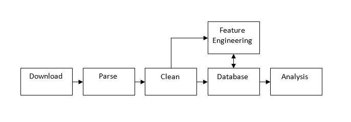

## Literature Review
  - [Project-Preparation Literature Review](https://github.com/alunmeredith/MSC-Project/blob/master/Deliverables/review.pdf)
  - [Planned Structure of Changes](https://github.com/alunmeredith/MSC-Project/blob/master/Dissertation/LiteratureReivewStructure.md)

## Data Processing / pipeline

##### Download datafiles from uspto website([Download_extract.R](https://github.com/alunmeredith/MSC-Project/blob/master/Code/Download_extract.R))
 - **107 Gb** of data covering the period of **1976 to 2001**. 
 - **2 Weeks of data missing from 2015** (denied download). This has very minimal in most of the analysis, mainly the count of patents published per year. It may have some biases and other effects so we can keep this in mind when looking at the citations. 
 - DataFiles in **3 major formats** (and minor schema changes); **text** (1976-2001), **sgml** (2001-2004) and **xml** (2005-present), there are some relavent schema changes within formats for sgml and xml. 
 - 1996 onlwards includes **list files** listing patents expected to be present. Sgml and XML are in the form of weekly files but for **2001-2013 concatonated files** for the whole year are also present, text format is in a single file. 
 
##### Parse each datafile for relavent information ([Parse_File_statebased.R](https://github.com/alunmeredith/MSC-Project/blob/master/Code/Parse_File_statebased.R))
 - This File contains a function which parses any of the raw datafiles and builds two tables (CSVs); one containing the patent information extracted and one containing the citation information extracted, so the citation information is a list of patent-citation pairs + additional citation information being recorded. The degree of each patent is also recorded at this point.  
 - The three different formats is the biggest issue, each file must be parsed in the same structure so systematic differences don't exist. Therefore **one function parses all datatypes** with minimal variation based on type. This was the case with an earlier iteration which used existing libraries to parse xml causing systematic differences with the custom text parser. 
 - The function written was written as **flexible** as possible, enabling new variables and changes in format to be accomadated easily. This was done by **linking tags in the data to actions**, such as "addCitationValue" which adds the value on this line to the current citation, or "flushPatent" which appends the current citation and patent information to the csv and building a new empty patent and citation vector. This means adding a new variable just means adding the relavent tags to the tags being searched linked to "addCitationValue". 
 - To overcome the fact that identical tags are present within nested environments in the data to mean different things (think xml structure) we use a **state based** architecture which identifies which section of a patent it is in. I.e. changes state to "citation" when within the citation section in order to interpret dates effectively. 

##### Parse each directory / year ([Parse_Directory3.R](https://github.com/alunmeredith/MSC-Project/blob/master/Code/Parse_Directory3.R))
 - This file contains a function to call *Parse_File_statebased()* appropriately for an entire year, assuming raw datafiles in the directory structure produced by the *Download_extract.R* script. If parsing is split into smaller files then it concatonates these into a single file for each year. 
 
##### Analysis of Cleaning ([Code](https://github.com/alunmeredith/MSC-Project/blob/master/Code/Analysis_Testing_Extraction_and_Cleaning.Rmd), [Results](https://github.com/alunmeredith/MSC-Project/blob/master/Code/Analysis_Testing_Extraction_and_Cleaning.pdf))
 - This is the first analysis file but put in the data pipeline because it is an analysis of the parsing section. 
 - Tests to find **differences between sgml and txt in 2001** which has copies of both. 
    - Some entries present in txt not present in sgml.
    - No entries in sgml not present in txt. 
    - This difference is very small 184078 vs 184173. 
 - Tests to find **differences between parsed patent counts**, those produced by a **uspto summary** page and those produced by the raw data **.lst files**. 
     - No differences until 2008. 
     After this time we parse more patents than found in uspto summary statistics. 
     - And less than the lst files. 
     - Again these are small maxing at around 2000 / ~ 300000 in 2014. 
     - Except 1976 and 2015.
        - 2015 because 2 months of data couldn't be downloaded. 
        - 1976 for unknown reasons. (data doesn't start in january?)
        - These differences are noted and kept in mind but thought unlikely to cause systematic differences in the citations for the analysis we are doing. (think about this further)
 - Looks at **cleaning steps necessary** and **sources of NA** values
    - Removing duplicated entires. 
    - Cleaning variables so they both match eachother (patent vs citation) and the website (patent numberse)
        - Removing extra digit at end of txt patent numbers.
        - Removing whitespace, punctuation (.), filler 0s so they match patent numbers on website. 
    - Sources of NAs
        - There are very few NAs produced
        - Errors parsing the raw data, primarily because that field was missing in the raw data, in our sample dataset this occured < 7 times. (these values appear to be errors and are all of the format "XXX  00", typically 0-10 per year)
        - Parsing the date into posixct causes 756 NAs, again due to the format of value in the date. 
            - Although there are more errors here it is ok because we retain Dat in addition to Date2 and 700 is still only about .1% of that year. 

#### Cleaning The Data ([Cleaning.R](https://github.com/alunmeredith/MSC-Project/blob/master/Code/Cleaning.R))
 - Makes sure entries are **unique**
 - Makes sure there are (correct) column names
 - Parses dates to "posixct" format  although keeps the original numeric date format (YYYYMMDD)
 - Ensures that **every patent is of a valid format**. 
    - Starts with "D|RE|PP|H| |T"
    - Has no 0s, whitespace or punctuation (primarily either at start of code or between the letters above and numeric code)
    - If extracted from a txt file remove an extra digit at the end of the patent number. 
 - Puts the cleaned file in a directory structure identical to the "Processed" directory that parse_directory_3. Directory is called "Cleaned."
 - Produces a concatonated patent file. 
    - Just small enough to fit in memory.
    - Makes some of the processing easier. 
    
##### Import data to mongodb([mongo_csv_import.bash](https://github.com/alunmeredith/MSC-Project/blob/master/Code/mongodb_csv_import.bash))
##### Build Indexes ([mongodbIndexes.js](https://github.com/alunmeredith/MSC-Project/blob/master/Code/mongodbIndexes.js))
 - The above two scripts do what they say on the tin
 - Data was uploaded to mongodb and added indexes. 
 - Reason for data to be put in a database is data was too large to process in memory.
    - Some analysis can be done by iteratively reading and processing files one at a time.
    - But some analysis needed to group the data by variables they wern't ordered by. This meant we needed a database.
    - Mongodb chosen because:
        - "Big Data" database: supports mapreduce and aggregation frameworks to help process big data. 
        - Javascript query / processing language and JSON object notation make it easy to use. 

##### Mongodb Feature engineering ([featureEngineering.js](https://github.com/alunmeredith/MSC-Project/blob/master/Code/featureEngineering.js))
 - Uses a mixture of mapReduce / aggregation frameworks and iterating over a cursor with serverside javascript.  
 - MapReduce to group by Patent and **count the total order, orderExaminer and orderOther for each patent.**     
    - This has to be supported by a join to join the results back into the patent table. 
    - Then perform another mapReduce to count the **frequencies of the orders for each year**. 
    - This is then exported to R where we plot how these frequencies vary with time. 
 - Aggregate to select only the OrderExaminer and OrderOther pairs from above transformation.
    - This allows us to produce a **scatterplot** to find the **correlation** between the two of these. 
    - We also compare the average value of one for a given value of another. 
 - Use a cursor to **add patent date (and patent date2) to each citation**. 
    - Using a cursor with **serverside javascript is *much* slower** than mapReduce and aggregate which are optimised and parallelised. 
    - In addition for each citation a match must be done to the patent table, this is the bottleneck. 
        - To reduce this we loop through the patents and use optimised aggregation function to update all matched citations at once. 
    - Also use a cursor to process the date variables as **ISOdate formats** and compute the time difference in ms between the two of them.  
        - Can't use same tricks as before, so this is very slow (> 1 day)
 - Use a cursor to sort by patent date / citation date and produce an **Indexed time**. 1 unit of time is one incoming citation to the network rather than real time. 
    - This counteracts the effects of exponentially increasing numbers of citations in analysis. 
    - Use mapReduce to calculate **indexed time difference for each citation**. (along with same join method as before)
    - Use mapReduce to calculate **frequencies** of each time difference for each order source (Total, Examiner, Other) to export to R. 
 - Incoming citation analysis
    - Group by reciever of citation (map). 
    - Choose a set of breaks in indexed time. Map each reciever to their order at that point in time. (reduce)
    - Count frequencies of each of these orders and plot. (mapReduce)
    
## Analysis

#### Reproducing Valverde ([Code](https://github.com/alunmeredith/MSC-Project/blob/master/Code/Analysis_Reproducing_Valverde.Rmd), [Results](https://github.com/alunmeredith/MSC-Project/blob/master/Code/Analysis_Reproducing_Valverde.pdf))
 - This script tries to reproduce two early plots in Valverde et. al's paper "Topology and Evolution of Technology Innovation Networks". 
    1. Number of patents varying over time (along with a cumulative log-log graph which they make a linear fit to)
    2. Degree distribution for a set of years. 
 1. We reproduce the general shape of their graph, which also matches uspto summary statistics and lst files.
    - There may be some small variations we can't quite identify. 
    - The cumulative plot is a bit dodgy
        - Clearly not a straight line (show that they probably were only fitting a subset of the data). In addition the data deviates from this fit in the "future years" after their data ends. 
 2. We find a similar phenomenon to valverde. 
    - Different gradients, we believe they didn't include foreign patent citations whereas we have. 
    - Absence of a "peak" i.e. starts high at 1 patent. 
        - Hard to understand the source of this difference but having a peak makes more logical sense. 

#### Fitting patents per year ([Code](https://github.com/alunmeredith/MSC-Project/blob/master/Code/Analysis_fitting_patents_cumdist.Rmd), [Results](https://github.com/alunmeredith/MSC-Project/blob/master/Code/Analysis_fitting_patents_cumdist.pdf))
 - As said before we don't agree with their power law fit. 
 - We try exponential fit
    - Show p values and R-squared for each
    - Show plots of each and how exponential fit seems a lot better. 
    
#### Fitting degree distribution ([Code](https://github.com/alunmeredith/MSC-Project/blob/master/Code/Analysis_fitting_degree_distribution.Rmd), [Results](https://github.com/alunmeredith/MSC-Project/blob/master/Code/Analysis_fitting_degree_distribution.pdf))
 - Evaluate the underlyind distribution of the overall dataset. 
 - Compare pois, exp, power law and log-normal. 
 - Using methods of Newman paper, through 'poweRlaw' package. 
    - null hypothesis of equal distances from distribution. 
    - p values based on log-likelihood ratio (if null hypothesis is true this is normally distributed)

#### Cited by Examiner Vs. Other: Order Analysis ([Code](https://github.com/alunmeredith/MSC-Project/blob/master/Code/OrderAnalysisWithCitedBy2.Rmd), [Results](https://github.com/alunmeredith/MSC-Project/blob/master/Code/OrderAnalysisWithCitedBy2.pdf))

#### Mean Degree per year ([Code](https://github.com/alunmeredith/MSC-Project/blob/master/Code/MoreMapReduceAnalysis.Rmd), [Results](https://github.com/alunmeredith/MSC-Project/blob/master/Code/MoreMapReduceAnalysis.pdf))
 - Mean degree per year
    - Shows that the Examiner mean degree stays fairly constant but 